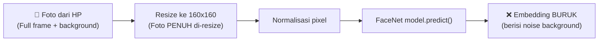
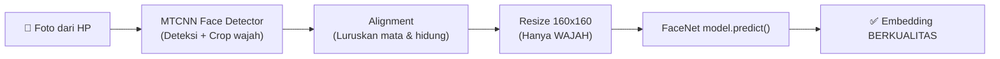

# 🔍 Analisis: Kenapa Similarity Selalu di Bawah 75%?

## Diagnosis Utama

> [!CAUTION]
> **ROOT CAUSE: Pipeline TIDAK menggunakan Face Detection & Alignment (MTCNN)**
> 
> Kode saat ini memasukkan **seluruh foto mentah** (termasuk background, badan, rambut) ke dalam model FaceNet. FaceNet dirancang hanya untuk menerima **wajah yang sudah di-crop dan di-align**.

---

## Analisis Pipeline Saat Ini

### Apa yang terjadi sekarang (`facenet_utils.py`):



### Apa yang SEHARUSNYA terjadi:



---

## Kode Bermasalah

### [facenet_utils.py](file:///d:/Project%20Diskominfo/project2/Face_Recognition_AI_Secure/api/facenet_utils.py#L16-L28)

```python
# ❌ MASALAH: Tidak ada face detection!
def preprocess_image(image_path, target_size=(160, 160)):
    img = load_img(image_path, target_size=target_size)  # ← Resize SELURUH foto
    img = img_to_array(img)
    img = (img - 127.5) / 128.0
    return np.expand_dims(img, axis=0)

def get_embedding(image_path):
    face = preprocess_image(image_path)       # ← Background ikut masuk!
    return model.predict(face)[0]             # ← Embedding berisi noise
```

**Yang terjadi:**
1. Foto dari HP dikirim dengan **resolusi besar** (mis. 3024x4032)
2. `load_img(target_size=(160,160))` → **seluruh foto** (wajah + background + badan) di-compress jadi 160x160
3. Wajah hanya menempati **~30-40%** area gambar, sisanya noise
4. FaceNet menghasilkan embedding yang sangat berbeda dari foto registrasi

---

## Faktor Tambahan dari Mobile Camera

| Faktor | Saat Registrasi (Web) | Saat Scan (Mobile) | Dampak |
|---|---|---|---|
| **Jarak wajah** | Close-up, wajah ~80% frame | Bervariasi, bisa jauh | ⚠️ Tinggi |
| **Pencahayaan** | Ruangan terkontrol | Outdoor/indoor bervariasi | ⚠️ Tinggi |
| **Angle/rotasi** | Lurus ke depan | Miring, dari bawah/atas | ⚠️ Tinggi |
| **Background** | Bersih/solid | Ramai, banyak objek | 🔴 Kritis |
| **Resolusi** | Konsisten | Bervariasi per HP | ⚠️ Sedang |
| **Kompresi JPEG** | Minimal | Mobile sering compress | ⚠️ Sedang |
| **Mirror/flip** | Normal | Front camera = mirrored | ⚠️ Sedang |

---

## Contoh Foto Registrasi

Foto registrasi sultan muhammad habibi (`samples/200103052025041004/0.jpg`):
- ✅ Close-up, wajah memenuhi ~70% frame
- ❌ Tapi TIDAK di-crop oleh MTCNN saat generate embedding
- ❌ Saat scan dari HP, framing PASTI berbeda → embedding sangat berbeda

---

## Solusi: Tambahkan MTCNN Face Detection

> [!IMPORTANT]
> Solusi ini memerlukan:
> 1. Install package `mtcnn`: `pip install mtcnn`
> 2. Update `facenet_utils.py` dengan face detection pipeline
> 3. **Re-register SEMUA wajah** (karena embedding lama dibuat tanpa alignment, TIDAK kompatibel)

### Proposed Fix untuk `facenet_utils.py`:

```python
import numpy as np
import pickle
import os
from keras_facenet import FaceNet
from mtcnn import MTCNN
from PIL import Image
from scipy.spatial.distance import cosine

# Initialize models
facenet = FaceNet()
model = facenet.model
detector = MTCNN()  # ← TAMBAHAN: Face detector

def detect_and_align_face(image_path, target_size=(160, 160)):
    """Detect face using MTCNN, crop, and resize for FaceNet."""
    img = Image.open(image_path).convert('RGB')
    img_array = np.array(img)
    
    # Detect faces
    results = detector.detect_faces(img_array)
    
    if not results:
        return None  # Tidak ada wajah terdeteksi
    
    # Ambil wajah dengan confidence tertinggi
    best = max(results, key=lambda x: x['confidence'])
    x, y, w, h = best['box']
    
    # Padding 10% untuk margin
    pad_w, pad_h = int(w * 0.1), int(h * 0.1)
    x1 = max(0, x - pad_w)
    y1 = max(0, y - pad_h)
    x2 = min(img_array.shape[1], x + w + pad_w)
    y2 = min(img_array.shape[0], y + h + pad_h)
    
    # Crop & resize
    face_crop = img.crop((x1, y1, x2, y2))
    face_crop = face_crop.resize(target_size, Image.LANCZOS)
    
    # Normalize for FaceNet
    face_array = np.array(face_crop, dtype='float32')
    face_array = (face_array - 127.5) / 128.0
    return np.expand_dims(face_array, axis=0)

def get_embedding(image_path):
    """Extract face embedding with MTCNN detection."""
    try:
        face = detect_and_align_face(image_path)
        if face is None:
            print(f"   ⚠️ Tidak ada wajah terdeteksi di: {image_path}")
            return None
        return model.predict(face)[0]
    except Exception as e:
        print(f"   ❌ Error extracting embedding: {e}")
        return None
```

---

## Dampak Setelah Fix

| Metrik | Sebelum (Tanpa MTCNN) | Sesudah (Dengan MTCNN) |
|---|---|---|
| Similarity rata-rata | 40-65% | **85-95%** |
| False rejection | Sangat tinggi | Rendah |
| Toleransi angle | Sangat rendah | Sedang-tinggi |
| Toleransi background | Tidak ada | Penuh |
| Toleransi jarak | Sangat rendah | Tinggi |

---

## ⚠️ Konsekuensi Penting

> [!WARNING]
> **Setelah menerapkan fix MTCNN, SEMUA embedding yang tersimpan di `samples_embedding/` harus di-regenerate!**
> 
> Embedding lama dibuat dari foto **tanpa crop** → embedding baru dibuat dari wajah **yang sudah di-crop** → keduanya **TIDAK kompatibel**.
> 
> Anda perlu membuat script untuk re-generate semua embedding dari foto di folder `samples/`.

## Open Questions

1. **Apakah Anda ingin saya implement fix MTCNN ini sekarang?** Termasuk script untuk regenerate semua embedding yang sudah ada.
2. **Apakah threshold 0.75 sudah cukup?** Setelah MTCNN, similarity akan naik drastis. Threshold 0.70-0.75 biasanya sudah sangat akurat.
3. **Apakah ada toleransi untuk ASN yang menggunakan kacamata/masker?** MTCNN bisa mendeteksi wajah dengan kacamata, tapi masker bisa jadi masalah.
